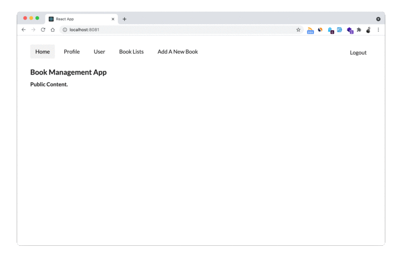

# React CRUD app 

## Usage
- Change env file `$ cd client` and `$ mv .env-example .env`
- Install dependencies with `$ npm install`.
- Run the application with `$ np start`. 👉 before running the front end application make sure server side app is running. 

